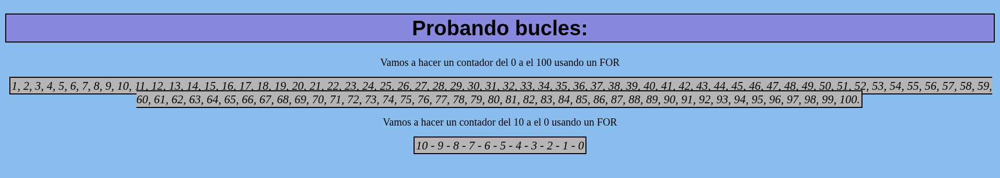
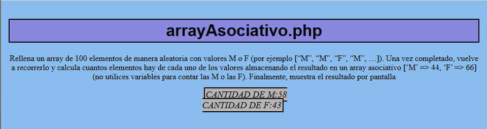
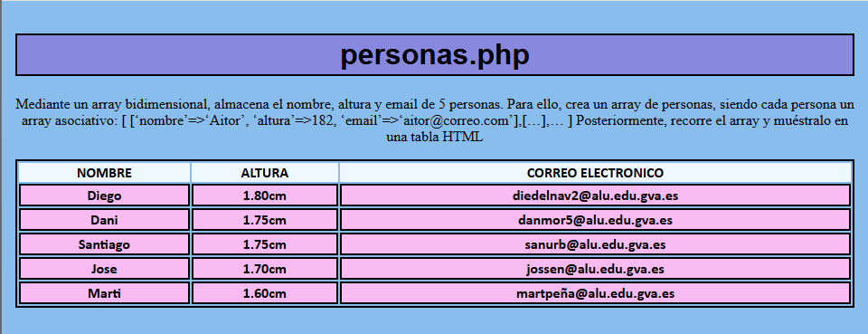
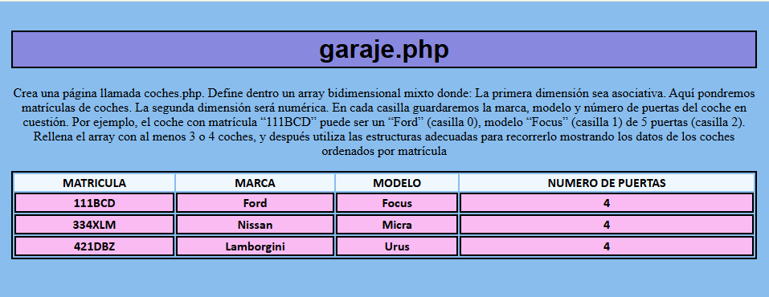
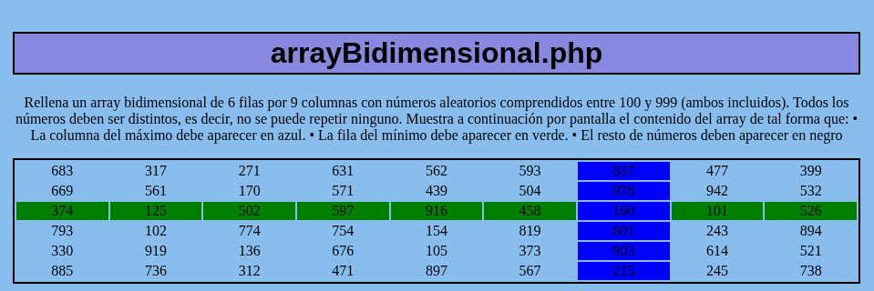
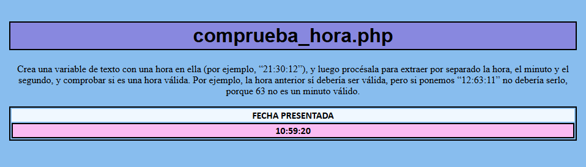

# Desarrollo-Servidor-26-27
Este es el GITHUB de la asignatura de Desarrollo de Servidor 26/27
## TEMA 1
#### `info_basica.php`
Para este ejercicio, crea un documento en esta carpeta llamado info_basica.php, similar al del ejemplo anterior, pero mostrando tu nombre y tu año de nacimiento usando variables. Es decir, crearás dos variables para almacenar estos dos datos, y los
mostrarás en una frase que diga “Me llamo XXXX y nací en el año YYYY”.
Prueba la página en un navegador y echa un vistazo al código fuente, intentando detectar qué contenidos HTML se han generado desde PHP.

Y esto quedaria asi: 


---

#### `curriculum.php` 

Crea una página en la carpeta de ejercicios llamada **curriculum.php** donde, utilizando
variables variables, muestres parte de tu currículum (por ejemplo, un párrafo con tus
estudios y otro con los idiomas que hablas), tanto en español,valencià como en otro
idioma que elijas.


#### `area_circular.php`

 Crea una página en la carpeta de ejercicios llamada area_circulo.php. En
ella, crea una variable $radio y ponle el valor 3.5. Según esa variable, calcula en otra
variable el área del círculo (PI * 𝑟𝑎𝑑𝑖𝑜2
), deberás definir la constante PI, y muestra por
pantalla el texto “El área del círculo es XX.XX”, donde XX.XX será el resultado de calcular el área.


#### `prediccion.php`

Intenta predecir qué resultado va a sacar por pantalla cada instrucción echo
de este código PHP. Luego podrás comprobar si estabas en lo cierto poniendo el código
en una página y probándolo en un navegador

- Codido a predecir: 
```php
<?php
$num1 = 3;
$num2 = 5;
$num3 = 8;
$num1 *= 4;
echo $num1;//12
echo $num1 <= $num2;//false
echo $num3 > $num1 and $num3 > $num2;//false
echo $num3 > $num1 or $num3 > $num2;//true
echo $num1 > $num2 xor $num1 > $num3;//false, XOR = true + true = false
$num3--;//7
echo $num3;//7
$num3 += $num1;//19
echo $num3;//19
?>
```

Paguina web: 


#### `prueba_if.php`
Crea una página llamada prueba_if.php en la carpeta de ejercicios del tema. Crea en
ella dos variables llamadas $nota1 y $nota2, y dales el valor de dos notas de examen
cualesquiera (con decimales si quieres). Después, utiliza expresiones if..else para determinar qué nota es la mayor de las dos.


#### `prueba_if2.php`

Modifica el ejercicio anterior añadiendo una tercera nota $nota3 , y determinando cuál
de las 3 notas es ahora la mayor. Para ello, deberás ayudarte esta vez de la estructura
if..elseif..else.


#### `contador.php`
Crea una página llamada contador.php en la carpeta de ejercicios del tema. Utiliza una
estructura for para contar los números del 1 al 100 (separados por comas), y luego una
estructura while para contar los números del 10 al 0 (una cuenta atrás, separada por
guiones).
Al final debe quedarte algo como esto:
1,2,3,4,5,6,7,8,9,10,11,12,13,14,15…
10-9-8-7-6-5-4-3-2-1-0



#### `array1.php`

Rellena un array con 50 números aleatorios comprendidos entre el 0 y el 99, y luego muéstralo en una lista desordenada. Para crear un número aleatorio, utiliza la función rand(inicio, fin) => $num = rand (0, 99).


#### `arrayAsociativo.php`

Rellena un array de 100 elementos de manera aleatoria con valores M o F (por ejemplo [“M”, “M”, “F”, “M”, …]). Una vez completado, vuelve a recorrerlo y calcula cuantos elementos hay de cada uno de los valores almacenando el resultado en un array asociativo [‘M’ => 44, ‘F’ => 66] (no utilices variables para contar las M o las F). Finalmente, muestra el resultado por pantalla



#### `personas.php`

Mediante un array bidimensional, almacena el nombre, altura y email de 5 personas. Para ello, crea
un array de personas, siendo cada persona un array asociativo: [ [‘nombre’=>‘Aitor’, ‘altura’=>182,
‘email’=>‘aitor@correo.com’],[…],… ] Posteriormente, recorre el array y muéstralo en una tabla
HTML.



#### `garaje.php`

Crea una página llamada coches.php. Define dentro un array bidimensional mixto donde:
La primera dimensión sea asociativa. Aquí pondremos matrículas de coches. La segunda dimensión
será numérica. En cada casilla guardaremos la marca, modelo y número de puertas del coche en
cuestión. Por ejemplo, el coche con matrícula “111BCD” puede ser un “Ford” (casilla 0), modelo “Focus” (casilla 1) de 5 puertas (casilla 2). Rellena el array con al menos 3 o 4 coches, y después utiliza las
estructuras adecuadas para recorrerlo mostrando los datos de los coches ordenados por matrícula



#### `arrayBidimensional.php`

Rellena un array bidimensional de 6 filas por 9 columnas con números aleatorios comprendidos entre 100 y 999 (ambos incluidos). Todos los números deben ser distintos, es decir, no se puede repetir ninguno. Muestra a continuación por pantalla el contenido del array de tal forma que: • La columna del máximo debe aparecer en azul. • La fila del mínimo debe aparecer en verde. • El resto de números deben aparecer en negro



#### ` contador.php`

Crea una página llamada contador.php. Crea una función llamada cuenta($a, $b
) que reciba dos parámetros y vaya contando de un número al otro, separando los
números por comas. Después, pruébala en el código PHP haciendo que cuente del 10
al 20.


#### `intercambia.php`

Crea una página llamada intercambia.php. Añade dentro una función llamada intercambia que reciba 2 parámetros numéricos por referencia, y lo que haga sea intercambiar sus valores. Es decir, si recibe el parámetro $a y el valor de $b , y $b tome el valor de $a


#### `parametrosVariables.php`
Crea las siguientes funciones: Una función que devuelva el mayor de todos los números recibidos como parámetro variables: function mayor(): int. Utiliza las funciones func_get_args(), etc… No puedes usar la función max().


#### `comprueba_hora.php`

Crea una variable de texto con una hora en ella (por ejemplo, “21:30:12”), y luego procésala
para extraer por separado la hora, el minuto y el segundo, y comprobar si es una hora válida.
Por ejemplo, la hora anterior sí debería ser válida, pero si ponemos “12:63:11” no debería serlo,
porque 63 no es un minuto válido.

